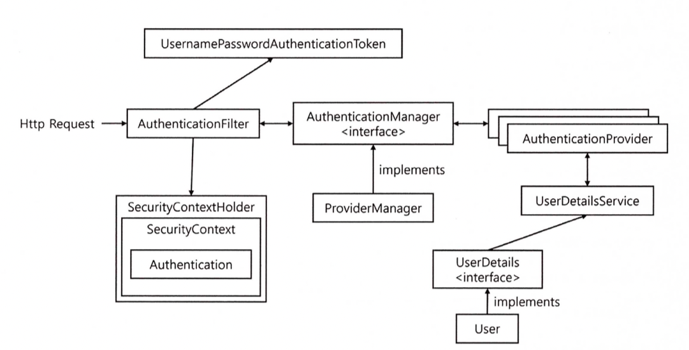
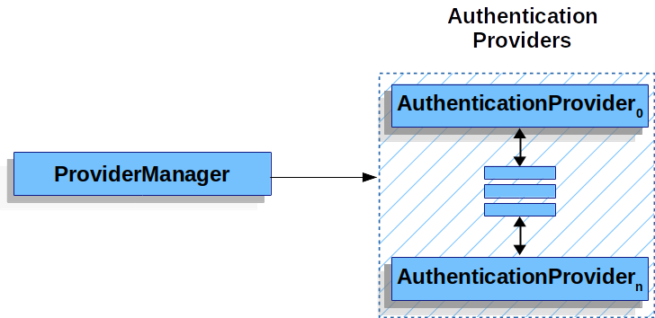
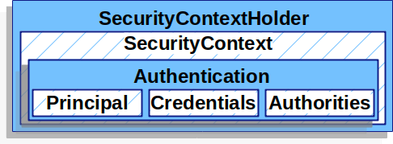

# Synopsis

<aside>
✏️ Spring Security의 기본적인 매커니즘을 공부하고 이해해 보자.
</aside>

# 동작 구조

전 시간에 봤던 Security 기본 구조이다. 여기에서 주의깊게 봐야할 점은 Manager 와 Provider 이다.

Manager 는 `여러 Provider`를 가질 수 있고 Provider 는 Authentication(Token)을 제공한다.

여기서 기억해야 하는 점은

- AuthenticationManager 는 여러개의 AuthenticationProvider를 가진다는 점
- AuthenticationProvider는 Authentication 구현체를 반환한다는 점이다.


## AuthenticationManager



- 기본적으로 Spring Security 제공하는 구현 객체는 `ProviderManager` 객체 이다.
- n개의 provider 를 가질 수 있으며 만약 provider 를 설정하지 않으면 `ProviderNotFoundException` 을 발생 한다.
- 제공된 provider에서 `support`를 이용하여 `authenticate` 할지 여부를 선택한다.
  - ProviderManager 소스 첨부

      ```java
      for (AuthenticationProvider provider : getProviders()) {
                  if (**!provider.supports(toTest)**) { // 여기서 통과하지 못하면 계속 skip 됨.
                      continue;
                  }
                  if (logger.isTraceEnabled()) {
                      logger.trace(LogMessage.format("Authenticating request with %s (%d/%d)",
                              provider.getClass().getSimpleName(), ++currentPosition, size));
                  }
                  try {
                      result = **provider.authenticate(authentication)**;
                      if (result != null) {
                          copyDetails(authentication, result);
                          break;
                      }
                  }
                  catch (AccountStatusException | InternalAuthenticationServiceException ex) {
                      prepareException(ex, authentication);
                      // SEC-546: Avoid polling additional providers if auth failure is due to
                      // invalid account status
                      throw ex;
                  }
                  catch (AuthenticationException ex) {
                      lastException = ex;
                  }
              }
      ```


## AuthenticationProvider

- 인증 제공자는 기본적으로 입력된 `Authentication`을 받아서 `인증`하고 다시 `Authentication`을 `리턴`하는 역활을 합니다.
- 기본적으로 2가지 메소드를 구현해야 한다.
  - support - 어떤 스탬프를 찍을 것인지에 대한 정보를 Manager 에게 제공하는 역활
    - 예를 들어 기본으로 생성되는 DaoAuthenticationProvider의 경우 UsernamePasswordAuthenticationToken으로 스탬프를 찍으므로 아래와 같이 코딩되어 있다.
      - supports

          ```java
            @Override
            // authentication이 UsernamePasswordAuthenticationToken 상속, 구현했는지 체크 한다.
              public boolean supports(Class<?> authentication) {
                  return (UsernamePasswordAuthenticationToken.class.isAssignableFrom(authentication));
              }
          ```

  - authenticate - authentication 을 인증하고 인증이 완료 되면 Token 을 생성하여 다시 리턴해주는 역활을 한다.

## Authentication

- 인증된 결과 + 인증을 위한 정보를 받기 위한 정보를 같이 가지고 있다.


- **Principal** - identifies the user. When authenticating with a username/password this is often an instance of `[UserDetails]`.
- **Credentials** - often a password. In many cases this will be cleared after the user is authenticated to ensure it is not leaked.
- **Authorities** - the `[GrantedAuthority]` are high level permissions the user is granted. A few examples are roles or scopes.
- **Details** - 위에 그림에는 빠져있지만, 기타 정보 및 인증에 관련된 정보를 담는다.

# Sample 코딩

모든 코드는 [🐙github](https://github.com/bnjjong/spring-secutiry-guide) 에 공개되어 있습니다.

## 목표

1. Student, Teacher Token 과 Provider를 각각 생성
2. 해당 Provider 를 `ProviderManager`에 등록하여 동작하는지 확인.
3. 최종적으로 CustomFilter 를 생성하여 AuthenticationManager 등록하고 기능 테스트 한다.
4. 샘플이므로 실제 패스워드 검증은 생략 한다.

## Authentication 구현


```java
@Getter
@ToString
@NoArgsConstructor(access = AccessLevel.PACKAGE)
public class Teacher {

  private String id;
  private String username;
  private Set<GrantedAuthority> role;

  public Teacher(String id, String username, Set<GrantedAuthority> role) {
    this.id = id;
    this.username = username;
    this.role = role;
  }
}

@Getter
@ToString
public class TeacherAuthenticationToken implements Authentication {

  private Teacher principal;
  private String credentials;
  private String details;
  @Setter
  private boolean authenticated;

  @Override
  public Collection<? extends GrantedAuthority> getAuthorities() {
    return principal == null ? new HashSet<>() : principal.getRole();
  }

  @Override
  public String getName() {
    return principal == null ? "" : principal.getUsername();
  }

  @Builder
  public TeacherAuthenticationToken(Teacher principal, String credentials, String details,
      boolean authenticated) {
    this.principal = principal;
    this.credentials = credentials;
    this.details = details;
    this.authenticated = authenticated;
  }
}
```

```java
@Getter
@ToString
@NoArgsConstructor(access = AccessLevel.PROTECTED)
public class Student {
  private String id;
  private String username;
  private Set<GrantedAuthority> role;

  @Builder
  public Student(String id, String username, Set<GrantedAuthority> role) {
    this.id = id;
    this.username = username;
    this.role = role;
  }
}

@Getter
@ToString
@NoArgsConstructor(access = AccessLevel.PROTECTED)
public class StudentAuthenticationToken implements Authentication {
  private Student principal;
  private String credentials;
  private String details;
  @Setter
  private boolean authenticated;

  @Override
  public Collection<? extends GrantedAuthority> getAuthorities() {
    return principal == null ? new HashSet<>() : principal.getRole();
  }

  @Override
  public String getName() {
    return principal == null ? "" : principal.getUsername();
  }

  @Builder
  public StudentAuthenticationToken(Student principal, String credentials, String details,
      boolean authenticated) {
    this.principal = principal;
    this.credentials = credentials;
    this.details = details;
    this.authenticated = authenticated;
  }
}
```


## Provider 구현


```java
@Component
public class TeacherTokenProvider implements AuthenticationProvider, InitializingBean {

  private HashMap<String, Teacher> teacherDB = new HashMap<>();

  @Override
  public Authentication authenticate(Authentication authentication) throws AuthenticationException {
    // 넘어온 토큰으로 인증을 하고 Token을 생성하여 리턴한다.
    TeacherAuthenticationToken token = (TeacherAuthenticationToken) authentication;
    String id = token.getPrincipal().getId();
    if (teacherDB.containsKey(id)) {
      Teacher teacher = teacherDB.get(id);
      return TeacherAuthenticationToken.builder()
          .principal(teacher)
          .details(teacher.getUsername())
          .authenticated(true)
          .build();
    }
    // 내가 처리할 수 없는 Authentication 은 null로 넘겨야 함.
    return null;
  }

  @Override
  public boolean supports(Class<?> authentication) {
    // 해당하는 토큰으로 받을 경우에 검증을 진행.
    return authentication == TeacherAuthenticationToken.class;
  }

  @Override
  public void afterPropertiesSet() throws Exception {
    Set.of(
        new Teacher("hong", "gildong", Set.of(new SimpleGrantedAuthority("ROLE_TEACHER"))),
        new Teacher("choi", "donggu", Set.of(new SimpleGrantedAuthority("ROLE_TEACHER"))),
        new Teacher("oh", "jihye", Set.of(new SimpleGrantedAuthority("ROLE_TEACHER")))
    ).forEach( s -> teacherDB.put(s.getId(), s));
  }
}
```

```java
@Component
public class StudentTokenProvider implements AuthenticationProvider, InitializingBean {

  private HashMap<String, Student> studentDB = new HashMap<>();

  @Override
  public Authentication authenticate(Authentication authentication) throws AuthenticationException {
    // CustomFilter 에서 StudentAuthenticationToken 으로 넘겨 줌.
    StudentAuthenticationToken token = (StudentAuthenticationToken) authentication;
    String id = token.getPrincipal().getId();
    if (studentDB.containsKey(id)) {
      Student student = studentDB.get(id);
      return StudentAuthenticationToken.builder()
          .principal(student)
          .details(student.getUsername())
          .authenticated(true)
          .build();
    }
    // 내가 처리할 수 없는 Authentication 은 null로 넘겨야 함.
    return null;
  }

  @Override
  public boolean supports(Class<?> authentication) {
    // 해당하는 토큰으로 받을 경우에 검증을 진행.
    return authentication == StudentAuthenticationToken.class;
  }

  @Override
  public void afterPropertiesSet() throws Exception {
    Set.of(
        new Student("han", "jongsang", Set.of(new SimpleGrantedAuthority("ROLE_STUDENT"))),
        new Student("jo", "sungmin", Set.of(new SimpleGrantedAuthority("ROLE_STUDENT"))),
        new Student("kim", "jongseo", Set.of(new SimpleGrantedAuthority("ROLE_STUDENT")))
    ).forEach( s -> studentDB.put(s.getId(), s));
  }
}
```


## Custom filter 생성


```java
public class CustomLoginFilter extends UsernamePasswordAuthenticationFilter {

  /**
   * 상위 클래스에서 정상 동작하게 하기 위해 {@code AuthenticationManager} 주입
   *
   * @param authenticationManager
   */
  public CustomLoginFilter(AuthenticationManager authenticationManager) {
    super(authenticationManager);
  }

  /**
   * Manager 에게 input 으로 받은 내용으로 authentication을 생성하여 넘겨 준다.
   *
   * @param request from which to extract parameters and perform the authentication
   * @param response the response, which may be needed if the implementation has to do a
   * redirect as part of a multi-stage authentication process (such as OpenID).
   * @return
   * @throws AuthenticationException
   */
  @Override
  public Authentication attemptAuthentication(HttpServletRequest request,
      HttpServletResponse response) throws AuthenticationException {
    // UsernamePasswordAuthenticationFilter#attemptAuthentication 내용 복사
    String username = obtainUsername(request);
    username = (username != null) ? username.trim() : "";
    String password = obtainPassword(request);
    password = (password != null) ? password : "";
    String type = request.getParameter("type");
    if (type == null || !type.equals("teacher")) {
      // student
      StudentAuthenticationToken token = StudentAuthenticationToken.builder()
          .principal(Student.builder().id(username).build())
          .credentials(password)
          .build();
      return this.getAuthenticationManager().authenticate(token);
    } else {
      // teacher
      TeacherAuthenticationToken token = TeacherAuthenticationToken.builder()
          .principal(Teacher.builder().id(username).build())
          .credentials(password)
          .build();
      return this.getAuthenticationManager().authenticate(token);
    }
  }
}
```


## Security config 설정

```java
@EnableWebSecurity(debug = true)
@EnableGlobalMethodSecurity(prePostEnabled = true)
@Slf4j
@RequiredArgsConstructor
public class SecurityConfig {

  private final StudentTokenProvider studentTokenProvider;
  private final TeacherTokenProvider teacherTokenProvider;
  

  @Bean
  public WebSecurityCustomizer webSecurityCustomizer() {
    return (web) -> web.ignoring().requestMatchers(
        // 아래 path 목록이 허가 됨.
        // /css/**, /js/**, /images/**, /webjars/**, /favicon.*, /*/icon-*
        PathRequest.toStaticResources().atCommonLocations() // static resources.
    );
  }

  @Bean
  public SecurityFilterChain filterChain(HttpSecurity http) throws Exception {
    AuthenticationManagerBuilder authenticationManagerBuilder = http.getSharedObject(
        AuthenticationManagerBuilder.class);
    // AuthenticationManager에 생성한 provider등록.
    AuthenticationManager authenticationManager = authenticationManagerBuilder
        .authenticationProvider(studentTokenProvider)
        .authenticationProvider(teacherTokenProvider)
        .build();
    CustomLoginFilter filter = new CustomLoginFilter(authenticationManager);

    http
        .authorizeRequests(request ->
            request.antMatchers("/", "/login").permitAll() 
                .anyRequest().authenticated()
        )
        // UsernamePasswordAuthenticationFilter 위치에 filter로 대체 한다.
        .addFilterAt(filter, UsernamePasswordAuthenticationFilter.class)
        .logout(logout -> logout.logoutSuccessUrl("/"))
        .authenticationManager(authenticationManager)
        .exceptionHandling(
            e -> e.accessDeniedPage("/access-denied")
        )
    ;

    return http.build();
  }
}
```

# 마무리

- 전체 그림을 이해한다면 매우 심플하고 직관적으로 구현되어 있음을 알 수 있다.
- 기본적으로 매우 확장성이 용이하게 개발이 되어 있어 다양한 비지니스 상황에 대처 할 수 있다.
- 샘플로는 미비된 기능이 많이 있다. 예를 들면 login fail 처리 및 success url 과 같은 기능을 일일히 구현해야 한다.  → 스콥 단위로 이해하는 목적으로 보도록 하자.
- 이 챕터 부분을 이해 했다면 나머지는 Security에서 무상으로 제공해주는 기능들이다. 목적과 용도에 맞게 잘 사용하도록 하자.

# Reference

- [Servlet Authentication Architecture :: Spring Security](https://docs.spring.io/spring-security/reference/servlet/authentication/architecture.html#servlet-authentication-authenticationprovider)
- [Architecture :: Spring Security](https://docs.spring.io/spring-security/reference/servlet/architecture.html)