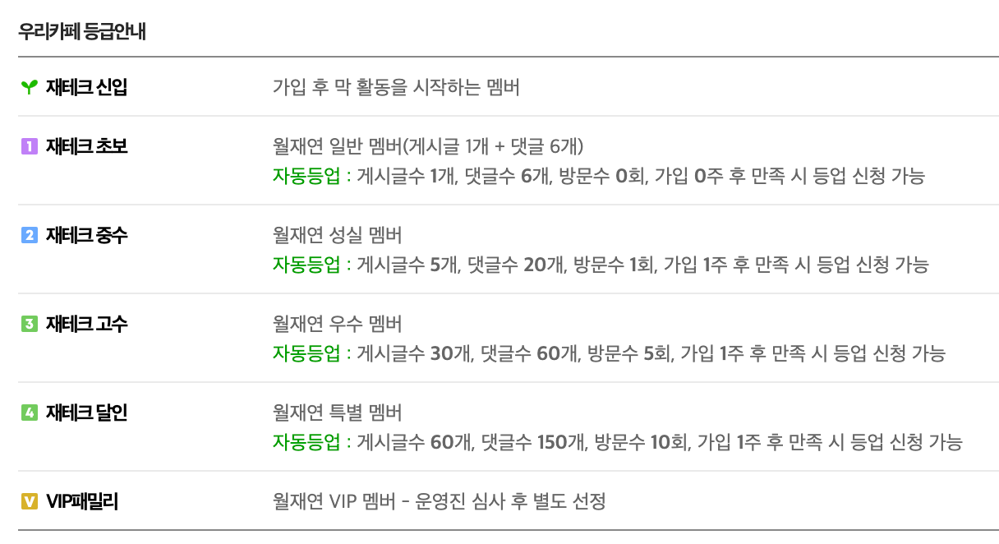

# Spring Security Basic

# Synopsis

<aside>
✏️ 웹사트의 각종 서비스를 하기위한 `서버 리소스`와 `사용자 정보`를 보호하기 위해 `보안정책`을 설정이 필요하다.  스프링 시큐리티는 이러한 `인증`과 `인가`를 관리해준다.

</aside>

## 인증(Authentication)

사이트에 접근하는 사람이 `누구`이고 `어떤 권한`을 가지고 있는지 알아야 한다.

기본적인 사이트를 기준으로 크게는 `사용자`와 `관리자`로 나눠지겠지만 세부적으로는 매우 다양하게 나눌 수 있다.

네이버와 같은 카페에서 멤버 등급을 생각하면 이해하기 편할 거라 생각이 든다.


기본적으로 Spring security에서 제공하는 인증 방법은 아래와 같다.

- UsernamePassword 인증
    - Session
    - Token
- SNS 로그인(소셜 로그인)
    - 인증 위임
    - OAuth

## 인가/권한(Authorization)

사용자가 누구인지 알았다면 해당 사용자가 할 수 있는 권한을 설정. 위에 예로 제시한 등급에 따라 사용할 수 있는 리소스를 `제한` 하거나 `허가` 하는 것을 의미한다.

Spring security 에서는 아래와 같은 방법으로 권한체크 한다.

- Secured (Deprecated)
- PrePostAuthorize (비교적 간단한 서비스에서 사용)
- AOP

## 스프링 시큐리티 보안 적용

아래와 같이 다중 계층 방식으로 보안을 적용 함.

스프링 시큐리티는 보안 위협에 대한 최신 방어책을 포함 함.

- 바람직하지 않은 정보가 브라우저 캐시에 유입되는 것 방지
- 서버 응답에 적절한 보안 헤더 추가
- 클릭재킹 ([Clickjacking | OWASP Foundation](https://owasp.org/www-community/attacks/Clickjacking))
- 세션 고정 공격 ([Session fixation | OWASP Foundation](https://owasp.org/www-community/attacks/Session_fixation))
- 크로스 사이트 스크립트 공격 ([Cross Site Scripting (XSS) | OWASP Foundation](https://owasp.org/www-community/attacks/xss/))
- 크로스 사이트 요청 위조 ([Cross Site Request Forgery (CSRF) | OWASP Foundation](https://owasp.org/www-community/attacks/csrf))

# 동작 구조

서블릿 필터 기반으로 동작하며 DispatcherServlet 앞에 필터가 배치되어 있음.


스프링 시큐리티는 사용하고자 하는 필터체인을 서블릿 컨테이너의 필터 사이에서 동작시키기 위해 `DelegatingFilterProxy`를 사용 한다. 표준 서블릿 필터를 구현하고 있으며 역할을 위임할 `FilterChainProxy`를 내부에 가지고 있다. 이는 스프링 부트의 자동 설정에 의해 자동 생성 됨.


보안 필터체인에 보안필터는 스프링 시큐리티에 기본적으로 제공하며 List 형태로 담을 수 있다.

별도의 설정을 하지 않으면 아래와 같이 UsernamePasswordAuthenticationFilter 를 통해 인증 처리 한다.


# Sample 코딩

모든 코드는 [🐙github](https://github.com/bnjjong/spring-secutiry-guide) 에 공개되어 있습니다.

## 목표

1. user, admin, anonymous 를 위한 api를 구현한다.
2. Spring security를 적용하여 사용자를 생성하고 로그인할 수 있도록 한다.
3. 각각 사용자 마다 권한 체크하여 동작할 수 있도록 설정 한다.

## API 개발

```java
@RestController
public class HomeApi {

  // 모두 접근 가능
  @GetMapping("/")
  public String index() {
    return "hello";
  }

  // 모두 접근 가능
  @GetMapping("/auth") // (1)
  public Authentication auth() {
    return SecurityContextHolder.getContext() 
        .getAuthentication();
  }

  // user 접근 가능
  @GetMapping("/user")
  public SecurityMessage user() {
    return new SecurityMessage(SecurityContextHolder.getContext()
        .getAuthentication(), "User info");
  }

  // admin 접근 가능
  @GetMapping("/admin")
  public SecurityMessage admin() {
    return new SecurityMessage(SecurityContextHolder.getContext()
        .getAuthentication(), "Admin info");
  }

}

```

(1) : securityContext 정보를 확인 할 수 있는 API

## 사용자 생성

Security를 테스트하는 목적이므로 InMemory에 사용하를 생성 한다.

```java
@EnableWebSecurity // (1)
@EnableGlobalMethodSecurity(prePostEnabled = true) // (2)
@Slf4j
public class SecurityConfig {

  @Bean
  public UserDetailsService userDetailsService() {
    InMemoryUserDetailsManager manager = new InMemoryUserDetailsManager();
    manager.createUser(User.withUsername("user2")
        .password(passwordEncoder().encode("2222"))
        .roles("USER")
        .build());
    manager.createUser(User.withUsername("admin")
        .password(passwordEncoder().encode("3333"))
        .roles("ADMIN")
        .build());
    return manager;
  }

  @Bean
  PasswordEncoder passwordEncoder() { // (3)
    return new BCryptPasswordEncoder();
  }

}
```

(1) : web security 적용 및 configuration bean 등록

(2) : 여기는 3가지 옵션을 제공한다. (아래 3가지다 기본 값은 `false` 이다)
이번에는 prePostEnabled 을 사용하여 인가 처리를 한다.

1. securedEnabled - @Secured 애노테이션을 사용하여 인가 처리를 하고 싶을때 사용하는 옵션이다.
2. **prePostEnabled** - @PreAuthorize, @PostAuthorize 애노테이션을 사용하여 인가 처리를 하고 싶을때 사용하는 옵션이다.
3. jsr250Enabled - @RolesAllowed 애노테이션을 사용하여 인가 처리를 하고 싶을때 사용하는 옵션이다.

(3) : 기본적으로 Password는 인코딩을 반드시 해야 한다.

## 권한 처리

아래 API에 권한 체크를 할 수 있도록 `@PreAuthorize` 어노테이션을 사용하여 체크 한다.

```java
  **@PreAuthorize("hasAnyAuthority('ROLE_USER')")**
  @GetMapping("/user")
  public SecurityMessage user() {
    return new SecurityMessage(SecurityContextHolder.getContext()
        .getAuthentication(), "User info");
  }

  **@PreAuthorize("hasAnyAuthority('ROLE_ADMIN')")**
  @GetMapping("/admin")
  public SecurityMessage admin() {
    return new SecurityMessage(SecurityContextHolder.getContext()
        .getAuthentication(), "Admin info");
  }
```

## Anonymous 를 위한 권한 처리

SecurityFilterChain에 “/”, “/auth” 는 권한 체크 없이 호출이 가능하도록 설정한다. 아래 설정 부분에 대해서는 좀 더 디테일하게 다룰 예정이다.

```java
  @Bean
  public SecurityFilterChain filterChain(HttpSecurity http) throws Exception {
    http.authorizeRequests(request ->
      request
          .antMatchers("/").permitAll()
          .antMatchers("/auth").permitAll()
          .anyRequest().authenticated()
    );
    http.formLogin();
    http.httpBasic();

    return http.build();
  }
```

## 테스트

처음에 목적한대로 잘 동작하는 것을 확인 할 수 있다.


# 마무리

- Spring Security는 100줄이 채 되지 않는 코드양으로 인증부터 인가까지 모두 구현할 수 있다.
- 만약 이것을 native 하게 작성해야 한다면 매우 많은 리소스를 써야 할 것이다.
- 추가로 Spring security는 더 방대하며 기본적으로 매우 많은 기능을 지원한다.
    - 지식이 곧 힘이다. 하나하나씩 테스트 하면서 본인이 필요로 하지 않는 보안은 disable 시키도록 하자.
        - 다음 회차에 좀 더 깊이 있게 들어가보도록 하자.
- 크리티컬한 보안 이슈의 경우 대부분 기본으로 제공해주고 있으므로 security를 적용만 한다면 대부분의 보안 문제를 커버할 수 있다.
- 여러모로 시대가 좋아져 개발자가 할 것이 많이 줄었다. 다만 개념과 시큐리티에서 해결해주는 보안이 어떤 것인지는 인지를 하고 사용하도록 하자.

# Reference

- [Spring Security without the WebSecurityConfigurerAdapter](https://spring.io/blog/2022/02/21/spring-security-without-the-websecurityconfigureradapter)